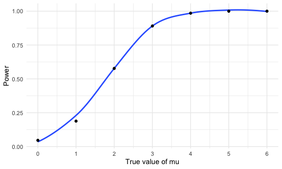

Homework 5
================
Mukta Patwari
2025-10-30

## Problem 1

**Write a function that, for a fixed group size, randomly draws
“birthdays” for each person; checks whether there are duplicate
birthdays in the group; and returns TRUE or FALSE based on the result.**

``` r
bday_sim = function(n_room) {
    birthdays = sample(1:365, n_room, replace = TRUE)
    
    repeated_bday = length(unique(birthdays)) < n_room
    
    repeated_bday
  }
```

**Next, run this function 10000 times for each group size between 2 and
50. For each group size, compute the probability that at least two
people in the group will share a birthday by averaging across the 10000
simulation runs.**

``` r
bday_sim_results =
  expand_grid(
    bdays = 2:50,
    iter = 1:10000
  ) %>%
  mutate(
    results = map_lgl(bdays, bday_sim)
  ) %>% 
  group_by(
    bdays
  ) %>% 
  summarize(
    prob_repeat = mean(results)
  )
```

**Make a plot showing the probability as a function of group size, and
comment on your results.**

``` r
bday_sim_results %>% 
  ggplot(aes(x = bdays, y = prob_repeat)) +
  geom_smooth(se = FALSE) +
  geom_point() +
  labs(
    x = "Number of people",
    y = "Probability of repeated birthdays"
  )
```

    ## `geom_smooth()` using method = 'loess' and formula = 'y ~ x'


The plot shows that as sample size increases, the probability of
repeated birthdays also increases. At around 23 people, the probability
of repeated birthdays is 50%, and at around 40 people the probability of
repeated birthdays is 87.5%. By the time the sample size is 50, the
probability is close to 100%.

## Problem 2

``` r
library(broom)

sim_t_test = function(n_subj = 30, sigma = 5, mu = 0) {
  
  sim_df =
    tibble(
      x = rnorm(n = n_subj, mean = mu, sd = sigma)
    ) %>% 
    summarize(tidy(t.test(x, mu = 0)))} %>% 
  mutate(
    hypothesis_test = case_when(
      p.value < 0.05 ~ "Reject",
      p.value > 0.05 ~ "Fail to Reject"
    )) %>% 
  select(estimate, p.value, hypothesis_test)


sim_results_df =
  expand_grid(
    mu = 0:6,
    iter = 1:5000
  ) %>% 
  mutate(
    results = map(mu, ~ sim_t_test(mu = .x))) %>%
  unnest(results)
```

**Make a plot showing the proportion of times the null was rejected (the
power of the test) on the y axis and the true value of mu on the x axis.
Describe the association between effect size and power.**

``` r
power_plot =
  sim_results_df %>% 
  group_by(mu) %>% 
  summarize(
    power = mean(hypothesis_test == "Reject"),
    .groups = "drop"
  ) %>% 
  ggplot(aes(x = mu, y = power)) +
  geom_smooth(se = FALSE) +
  geom_point() +
  scale_x_continuous(
    breaks = 0:6
  ) +
  labs(
    x = "True value of mu",
    y = "Power",
  )

print(power_plot)
```

    ## `geom_smooth()` using method = 'loess' and formula = 'y ~ x'



**Make a plot showing the average estimate of mu-hat on the y axis and
the true value of mu on the x axis. Make a second plot (or overlay on
the first) the average estimate of mu-hat only in samples for which the
null was rejected on the y axis and the true value of mu on the x
axis.**

## Problem 3

``` r
homicide_data =
  read_csv("homicide-data.csv") %>% 
  janitor::clean_names() %>% 
  mutate(city_state = paste(city, state, sep = ", "))
```

    ## Rows: 52179 Columns: 12
    ## ── Column specification ────────────────────────────────────────────────────────
    ## Delimiter: ","
    ## chr (9): uid, victim_last, victim_first, victim_race, victim_age, victim_sex...
    ## dbl (3): reported_date, lat, lon
    ## 
    ## ℹ Use `spec()` to retrieve the full column specification for this data.
    ## ℹ Specify the column types or set `show_col_types = FALSE` to quiet this message.
