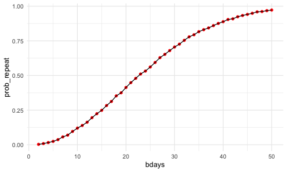

Homework 5
================
Mukta Patwari
2025-10-30

# Problem 1

``` r
birthdays = sample(1:365, 5, replace = TRUE)

repeated_bday = length(unique(birthdays)) < 5

repeated_bday
```

    ## [1] FALSE

``` r
bday_sim = function(n_room) {
  
    birthdays = sample(1:365, n_room, replace = TRUE)
    
    repeated_bday = length(unique(birthdays)) < n_room
    
    repeated_bday
  }
```

``` r
bday_sim_results =
  expand_grid(
    bdays = 2:50,
    iter = 1:10000
  ) %>% 
  mutate(
    results = map_lgl(bdays, bday_sim)
  ) %>% 
  group_by(
    bdays
  ) %>% 
  summarize(
    prob_repeat = mean(results)
  )
```

plot

``` r
bday_sim_results %>% 
  ggplot(aes(x = bdays, y = prob_repeat)) +
  geom_point(color = "red") +
  geom_line()
```


